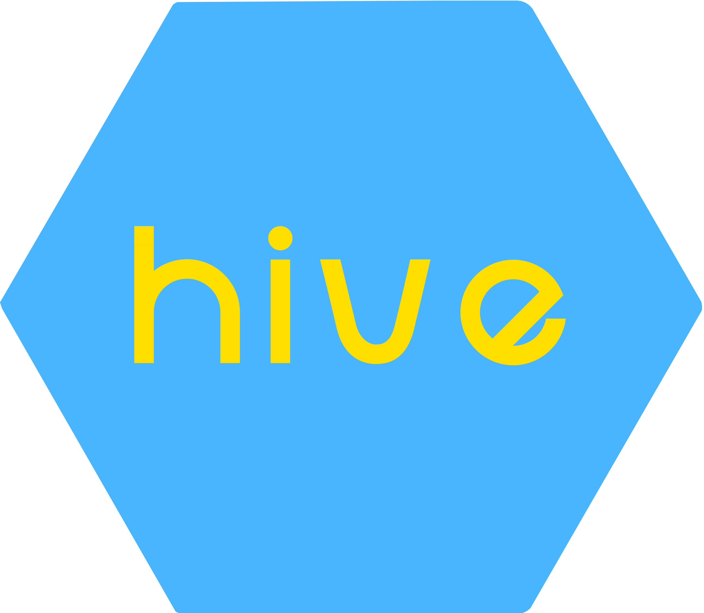

# Hive - Student Marketplace Platform

<div align="center">
  
  <h3>https://hivemarketplace.vercel.app/</h3>
</div>

## About Hive

Hive is a peer-to-peer marketplace platform designed specifically for students. It allows students to rent and share textbooks, dorm essentials, and other items at a fraction of the cost of buying new.

## Live Demo

Visit my live demo at [hivemarketplace.vercel.app](https://hivemarketplace.vercel.app/)

## Features

- Browse listings by category
- Search for specific items
- Create listings for items you want to rent out
- Secure messaging between users
- User profiles and ratings
- Mobile-responsive design

## Tech Stack

- Next.js 14
- React
- Tailwind CSS
- Radix UI Components
- Vercel Deployment

## Getting Started

1. Clone the repository
```bash
git clone https://github.com/Gunjiilkham/hive.git
```

2. Install dependencies
```bash
npm install --legacy-peer-deps
```

3. Run the development server
```bash
npm run dev
```

4. Open [http://localhost:3000](http://localhost:3000) in your browser

## Mobile View

The application is fully responsive and works great on mobile devices. Visit the live demo on your phone to experience the mobile interface.

## License

© 2025 Hive. All rights reserved. 
